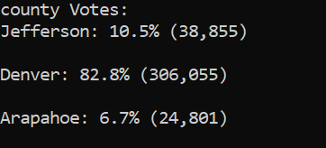
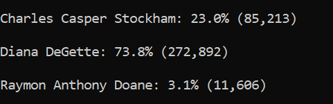
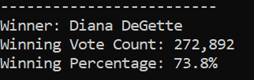

# PyPoll with Python

## Overview of Election Audit

The Audit is meant to provide the commission with more insights on the election results regarding how each county performed in the election.

## Election-Audit Results: 

There was a total of 369,711 votes cast in this congressional election.

The breakdown of the votes per county, as well as the % was as following:
 

Denver had the largest number of votes.

The breakdown of the number of votes and the percentage of the total votes each candidate received was as following:
 

The election was won by Diana DeGette, who got 272,892 votes, which represents 73.8% of the total votes.
  

## Election-Audit Summary: 

Business proposal to the election commission:

The script used to audit this election results can be used for any other election and would help the commission have insightful details about how the election was and how the votes were distributed.

For example:

- We can change the wording “county” in the script by “province” to analyse how federal election performed by province and see what province had the highest participation rate and which one influenced the final election result.

- We can change the wording “county” by “city” to know how provincial elections performed by city and what cities had the higher participation rate and which ones drove the final result.
